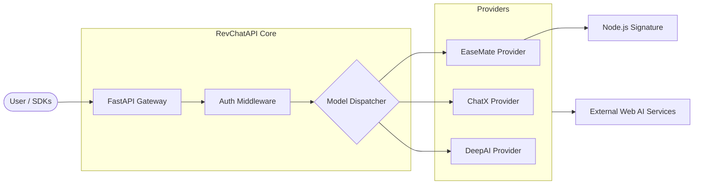

# RevChatAPI

<p align="center">
  
  
  
</p>

---

**RevChatAPI** là một API Gateway được thiết kế để biến các dịch vụ Chat AI trên Web thành API ổn định. Với cơ chế tự động điều phối và quản lý đa tài khoản, có khả năng tương thích tối đa với chuẩn OpenAI/Anthropic phổ biến hiện nay.

**Tài liệu nhanh:** [Admin Guide](#giao-diện-quản-trị-admin-ui) / [Kiến trúc](#tổng-quan-kiến-trúc) / [Cài đặt](#hướng-dẫn-cài-đặt-nhanh)

---

> ### ⚠️ Tuyên bố miễn trừ trách nhiệm
> 
> Dự án này được cung cấp hoàn toàn cho mục đích **nghiên cứu, giáo dục và thử nghiệm cá nhân**. Bằng việc sử dụng mã nguồn này, bạn mặc nhiên đồng ý với các điều khoản sau:
> 
> 1. **Mục đích:** Dự án không cấp bất kỳ quyền thương mại nào và không đảm bảo về tính ổn định hay hiệu quả sử dụng thực tế.
> 2. **Rủi ro:** Tác giả và những người đóng góp không chịu trách nhiệm cho bất kỳ tổn thất trực tiếp hoặc gián tiếp, việc bị khóa tài khoản, mất dữ liệu, hoặc các rủi ro pháp lý phát sinh từ việc sử dụng, sửa đổi hay triển khai dự án này.
> 3. **Tuân thủ:** Người dùng có trách nhiệm tự tìm hiểu và tuân thủ tuyệt đối Điều khoản dịch vụ, pháp luật và quy định của các nhà cung cấp bên thứ ba (như EaseMate, ChatX, OpenAI, v.v.).
> 4. **Bản quyền:** Mọi hoạt động sử dụng ngoài mục đích nghiên cứu cá nhân cần được xem xét kỹ lưỡng dựa trên giấy phép `LICENSE` và các quy định hiện hành.

---

## Mục lục

- [Tổng quan kiến trúc](#tổng-quan-kiến-trúc)
- [Tính năng vượt trội](#tính-năng-vượt-trội)
- [Khả năng tương thích Model](#khả-năng-tương-thích-model)
- [Hướng dẫn cài đặt nhanh](#hướng-dẫn-cài-đặt-nhanh)
- [Cấu hình hệ thống](#cấu-hình-hệ-thống)
- [Giao diện Quản trị (Admin UI)](#giao-diện-quản-trị-admin-ui)
- [Tuyên bố miễn trừ trách nhiệm](#tuyên-bố-miễn-trừ-trách-nhiệm)

---

## Tổng quan kiến trúc

Hệ thống được thiết kế theo dạng Module hóa (Modular), tách biệt rõ rệt giữa lớp xử lý Protocol và lớp Provider backend.



---

## Tính năng vượt trội

| Tính năng | Mô tả chi tiết |
| :--- | :--- |
| **OpenAI Standard** | Hỗ trợ đầy đủ `/v1/chat/completions` và `/v1/models`. |
| **Claude Protocol** | Tương thích chuẩn Anthropic `/v1/messages`. |
| **Streaming Real-time** | Phản hồi cực nhanh thông qua Server-Sent Events (SSE). |
| **Failover thông minh** | Tự động chuyển đổi tài khoản khi một tài khoản gặp lỗi hoặc giới hạn. |
| **Giao diện Admin** | Dashboard hiện đại để quản lý Key, Account và Test Model. |
| **EaseMate Engine** | Tích hợp sâu với Node.js để giải mã chữ ký (Signature) an toàn. |

---

## Khả năng tương thích Model

### DeepAI Provider (Standard & Specialized)
Cung cấp các model mã nguồn mở và model được tinh chỉnh (No account needed).

| Model ID | Mapping |
| :--- | :--- |
| `deepai/standard` | `standard` |
| `deepai/deepseek-v3.2` | `deepseek-v3.2` |
| `deepai/gemini-2.5-flash-lite` | `gemini-2.5-flash-lite` |
| `deepai/gemma-4` | `gemma-4` |
| `deepai/gpt-4.1-nano` | `gpt-4.1-nano` |
| `deepai/gpt-oss-120b` | `gpt-oss-120b` |
| `deepai/qwen3-30b-a3b` | `qwen3-30b-a3b` |
| `deepai/gpt-5-nano` | `gpt-5-nano` |
| `deepai/llama-3.3-70b-instruct` | `llama-3.3-70b-instruct` |
| `deepai/llama-3.1-8b-instant` | `llama-3.1-8b-instant` |
| `deepai/llama-4-scout` | `llama-4-scout` |

### EaseMate Provider (Gemini & More)
Sử dụng công nghệ Signature để gọi trực tiếp vào API của EaseMate.

| Model ID | Mapping |
| :--- | :--- |
| `easemate/llama-3.3` | `1` |
| `easemate/claude-3-haiku` | `2` |
| `easemate/gpt-4o-mini` | `3` |
| `easemate/deepseek-v3.2` | `4` |
| `easemate/deepseek-r1` | `5` |
| `easemate/gemini-2.0-flash` | `6` |
| `easemate/kimi-k2.5` | `10` |
| `easemate/qwen3-235b` | `11` |
| `easemate/gemini-3.0-flash` | `17` |

### ChatX Provider (DeepSeek & GPT)
Hỗ trợ nhiều tài khoản để chuyển đổi.

| Model ID | Mapping |
| :--- | :--- |
| `chatx/deepseek-v3-flash` | `deepseek_flash` |
| `chatx/gpt-3.5-turbo` | `gpt3` |

---

## Hướng dẫn cài đặt nhanh

Dự án yêu cầu **Python 3.10+** và **Node.js 18+**.

### 1. Chuẩn bị môi trường

**Backend (Python):**
```bash
# Clone source code
git clone https://github.com/HitroxVN/RevChatAPI.git
cd RevChatAPI

# Cài đặt Python dependencies
python -m venv venv
source venv/bin/activate # Hoặc venv\Scripts\activate trên Windows
pip install -r requirements.txt
```

**Frontend (Node.js):**
```bash
# Cài đặt và build giao diện Admin
cd frontend
npm install
npm run build
cd ..
```

### 2. Thiết lập cấu hình
```bash
cp .env.example .env
cp config.example.json config.json
```

### 3. Khởi chạy
```bash
python run.py
```
Hệ thống sẽ mặc định chạy tại `http://localhost:5000`.

---

## Cấu hình hệ thống

### Biến môi trường (.env)
- `ADMIN_KEY`: Khóa bí mật để truy cập Admin UI.
- `REQUIRE_AUTH`: Đặt là `True` để yêu cầu API Key khi gọi chat.
- `NODE_PATH`: Đường dẫn tới thực thi `node` (nếu không ở trong PATH).

### File config.json
Quản lý danh sách API Key cho người dùng và thông tin tài khoản của các Provider.

---

## Giao diện Quản trị (Admin UI)

Truy cập `/admin` để trải nghiệm Dashboard quản trị:

- **API Keys:** Cấp phát và giới hạn quyền truy cập cho khách hàng.
- **Accounts:** Thêm mới tài khoản ChatX hoặc EaseMate (hỗ trợ Verify ngay tại chỗ).
- **Test Lab:** Giao diện Chat trực quan để kiểm tra độ ổn định của các Model trước khi triển khai.

---

## Tuyên bố miễn trừ trách nhiệm

Dự án này được xây dựng thông qua kỹ thuật reverse engineering và chỉ được cung cấp cho mục đích học tập, nghiên cứu, thử nghiệm cá nhân. Không có sự ủy quyền thương mại nào được cấp và không có đảm bảo về tính ổn định, sự phù hợp hoặc kết quả sử dụng.

Tác giả và những người duy trì kho lưu trữ không chịu trách nhiệm cho bất kỳ tổn thất trực tiếp hoặc gián tiếp, việc bị khóa tài khoản, mất mát dữ liệu, rủi ro pháp lý hoặc khiếu nại của bên thứ ba phát sinh từ việc sử dụng, sửa đổi, phân phối, triển khai hoặc tin tưởng vào dự án này.

Không sử dụng dự án này theo những cách vi phạm điều khoản dịch vụ, thỏa thuận, luật pháp hoặc quy tắc của nền tảng. Trước khi sử dụng thương mại, hãy xem lại `LICENSE`, các điều khoản liên quan và xác nhận rằng bạn có sự cho phép bằng văn bản của tác giả.

---
<p align="center">Made with ❤️ by <b>HitroxVN</b></p>
